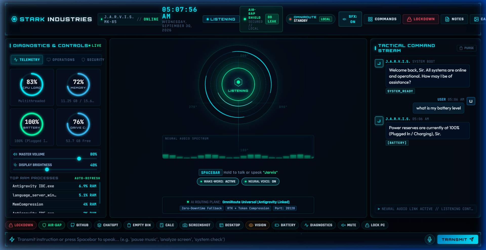

# ⚡ J.A.R.V.I.S. (Stark Industries Operating System)

<div align="center">



[](https://github.com/poharekulbhushan2006-code/jarvis-stark-os)
[](https://www.python.org/)
[](https://fastapi.tiangolo.com/)
[](https://github.com/poharekulbhushan2006-code/jarvis-stark-os)
[](https://vercel.com/)

**Just A Rather Very Intelligent System** — Fully Autonomous, 100% Air-Gapped AI Operating System & Holographic HUD for Windows.

</div>

---

## 🌟 Overview

**J.A.R.V.I.S.** is an autonomous laptop intelligence system modeled directly after Tony Stark's iconic assistant (voiced in the authentic British style of Paul Bettany). It combines millisecond double-clap acoustic activation, offline speaker biometrics, Windows DPAPI hardware-level credential vaulting, a 10-second auto-shutdown watchdog, and an ultra-futuristic holographic HUD interface built with dynamic Web Audio synthesizers and interactive particle fields.

---

## 🛡️ Core Capabilities & Architectural Pillars

### 1. 👏 Millisecond Double-Clap & Spoken Wake-Word
- **Impulsive Spike Detection:** Listens continuously in low-CPU background standby (~0.1% CPU) for two sharp hand claps (120ms – 920ms gap) or spoken wake words (*"Jarvis"*, *"Hey Jarvis"*, *"You Jarvis"*, *"Unlock"*).
- **Adaptive Acoustic Thresholding:** Dynamically calculates ambient room RMS noise levels (`max(0.20, min(0.48, ambient_rms * 4.2))`) with crest-factor analysis (`>= 2.5`) to register natural claps without false triggers from typing or computer audio.
- **Instant Local Vosk Speech Recognition:** Analyzes speech locally via Kaldi C++ engine in ~15ms with 0 internet lag.

### 2. ⏳ 10-Second Inactivity Watchdog & Auto-Shutdown
- **Zero Background Resource Waste:** When triggered via clap or voice, Jarvis starts up, greets you, and arms a 10-second countdown watchdog.
- **Automatic Power Down:** If no instruction is spoken or received within 10 seconds, Jarvis announces:
  > *"No instructions detected, Sir. Powering down systems and returning to standby."*
  Jarvis automatically closes the browser HUD via Windows `Ctrl+W` simulation and completely terminates the backend server.
- **Active Disarming:** Any spoken directive, quick chip click, or keyboard input immediately disarms the timer and keeps Jarvis online and actively listening.

### 3. 🎙️ Continuous Active Conversation Mode
- **Zero Dropped Commands:** Once the HUD is open, Jarvis remains in continuous **`LISTENING`** mode. You can speak directives directly (*"what is the time"*, *"open calculator"*, *"battery level"*) without needing to repeat the wake word every sentence.
- **Smart Follow-Ups:** When Jarvis finishes speaking a response, it automatically transitions back to active listening.

### 4. 🔒 Strict Air-Gap Privacy & Data Leak Protection
- **100% Localhost Bound:** All WebSocket and REST endpoints are strictly bound to `127.0.0.1` (loopback only). External network access is impossible.
- **Zero Outbound Leakage:** Sensitive tokens, credentials, and acoustic signatures are prevented from leaving the machine.
- **DPAPI Hardware-Encrypted Vault:** Windows Data Protection API (DPAPI) encrypts lock screen credentials directly into `cache/auth.vault`, accessible only by the logged-in Windows user session.

### 5. 🔓 Biometric Windows Lock Screen Auto-Unlock
- When triggered via verified voice or double clap while your workstation is locked, Jarvis wakes the display, automatically decrypts DPAPI credentials, inputs the password, submits Enter, and launches the HUD.

### 6. 🌐 Stark Industries Holographic HUD
- **Gyroscopic Arc Reactor:** Central visualizer with SVG tachymeter rings, angle hash marks, and sound-wave reactive spectrum bars.
- **Futuristic Audio Synthesizer:** Pure Web Audio API procedural sound effects for button clicks, voice transmissions, arc power-ups, and lockdown alarms.
- **Tactical Command Matrix:** Modal interface categorized by Operations, System, Media, Apps, and Security with live keyword filtering.
- **Interactive Particle Background:** Ambient drifting neural dust with mouse proximity repulsion.

---

## 🚀 Quick Launch & CLI Controls

| Script | Purpose |
| :--- | :--- |
| **`run_jarvis_listener.bat`** | Starts the background listener in an interactive console window with live clap detection metrics. |
| **`run_jarvis_silent.vbs`** | Runs the background listener completely hidden (0 windows open, ~0.1% CPU). |
| **`run_jarvis.bat`** | Directly boots the FastAPI backend and opens the holographic HUD browser interface. |
| **`install_startup.bat`** | Adds Jarvis Background Listener to Windows Startup (`%APPDATA%\...\Startup`). |
| **`uninstall_startup.bat`** | Removes Jarvis from Windows Startup. |
| **`register_voice.bat`** | Calibrates and locks Jarvis to your voice only using MFCC voice biometrics. |
| **`setup_lockscreen.bat`** | Stores lock screen password in Windows DPAPI encrypted vault. |
| **`stop_jarvis.bat`** | Instantly terminates all Jarvis processes and frees port 8000. |

---

## 🛠️ Supported Voice Directives

- **Time & Date:** *"what is the time"*, *"tell me the date"*, *"what day is today"*
- **Hardware Telemetry:** *"battery status"*, *"CPU usage"*, *"RAM statistics"*, *"system check"*
- **Volume & Audio:** *"volume 80"*, *"volume up"*, *"mute audio"*, *"unmute"*
- **Display Brightness:** *"brightness 70"*, *"increase brightness"*, *"dim display"*
- **Application Control:** *"open camera"*, *"open calculator"*, *"open notepad"*, *"open task manager"*, *"open chrome"*, *"close notepad"*
- **Web Destinations:** *"open youtube"*, *"open github"*, *"open chatgpt"*, *"search google for [query]"*
- **Security & Privacy:** *"lock workstation"*, *"unlock screen"*, *"security status"*, *"emergency lockdown"*, *"toggle airgap"*
- **Standby & Shutdown:** *"shutdown"*, *"go to sleep"*, *"power down"*, *"standby"*

---

## 🌐 Deploying to Vercel (Web Showcase)

The repository includes a ready-to-deploy [`vercel.json`](vercel.json) that publishes the holographic Stark Industries HUD interface as a live static web showcase:

1. Push this repository to your GitHub account:
   ```bash
   gh repo create jarvis-stark-os --public --source=. --push
   ```
2. Import the repository in [Vercel](https://vercel.com/new).
3. Vercel automatically detects [`vercel.json`](vercel.json) and serves the static HUD with mock telemetry and cyber animations!

---

## 👤 Author & Credits

- **Creator & Lead Architect:** [Kulbhushan Kailas Pohare](https://github.com/poharekulbhushan2006-code)
- **Email:** poharekulbhushan2006@gmail.com
- **Inspired by:** Marvel's J.A.R.V.I.S. (Tony Stark / Stark Industries / Paul Bettany)
- **License:** MIT License
